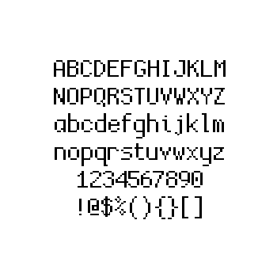
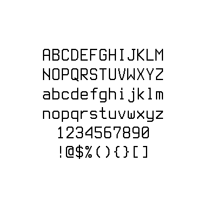
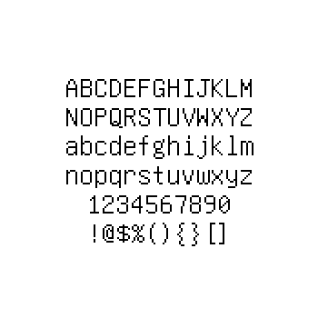
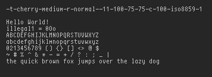

<style>
	.content-box-demo {
		padding: 1em;
		background-color: #fdffdf;
		color: #000;
	}
	.content-box-demo > * {
		padding: 1em;
		border: 5px solid #737373;
		background-color:#e3dcff;
	}
	.content-box-demo > * > * {
		padding: 1em;
		background-color:#cff0fb;
	}
</style>
# 🎨 Design
Stuff related to the general design of a rice

## Typography
> The style and appearance of printed matter.

This is one place where you can really stand out and using a good font can make all the difference for both the looks of your rice, as well as its usability.
Generally you will need 3 font faces:
- A sans serif face for general user interface
- A monospace font for code
- A serif fonts for documents

More on the differences between serif, sans-serif and mono space: https://www.canva.com/learn/serif-vs-sans-serif-fonts/

You can find most of them on [Google Fonts](https://fonts.google.com);
More on fonts: https://github.com/wooosh/themewiki/blob/master/guide/fonts.md
Here are the fonts I personally like for each one:

#### Mono space:
<div class="horizontal showcase">
[](https://fonts.google.com/specimen/Roboto+Mono)
[](https://fonts.google.com/specimen/IBM+Plex+Mono)
[](https://www.jetbrains.com/lp/mono/)
[](https://github.com/be5invis/Sarasa-Gothic)
[](https://juliamono.netlify.app/)
</div>

#### Serif:
<div class="horizontal showcase">
[](https://www.redaction.us/)
[](https://edwardtufte.github.io/et-book/)
[](https://fonts.google.com/specimen/Piazzolla)
</div>

#### Sans Serif:
<div class="horizontal showcase">
[](https://fonts.google.com/specimen/Roboto)
[](https://fonts.google.com/specimen/Ubuntu)
[](https://www.ibm.com/plex/)
[](https://fonts.google.com/specimen/Poppins)
</div>

🏴‍☠️ [Repository of mostly monospace fonts](https://gitlab.com/exorcist365/fonts)
Compare Different Fonts: [ThemeWiki](https://wooosh.github.io/themewiki/fontindex/)

#### Nerd Fonts
Nerd fonts are patched versions of common fonts you know and love to include a large amount of text icons, these are commonly used in apps that are unable to actually render icons.

Where to get: https://www.nerdfonts.com/font-downloads (Get the one for the font you want)
What icons are there: https://www.nerdfonts.com/cheat-sheet
You then copy the icons from the site (^^) and use them in whatever text application you so choose.
How to patch your own font:
```sh
# Download the nerd fonts patcher and the glyphs it needs.
git clone --filter=blob:none --sparse git@github.com:ryanoasis/nerd-fonts
cd nerd-fonts
git sparse-checkout add src/glyphs

# Using the patcher
# You need fontforge & Python 3 for this to work:
./font-patcher <PATH TO FONT>
```

#### Bitmap Fonts

<div class="split">


</div>

[What are they?](http://www.cs.ucc.ie/~gavin/cs1050/the_internet/slides/ch07s01s01.html.htm)

Effectively this means,
Bitmaps will not scale outside their designed font size;
They will generally look a lot sharper than vector fonts because they are generally rendered without [AA](https://www.youtube.com/watch?v=hqi0114mwtY);
All of which leads to pretty unique pixilated look that a lot of people like.

##### Using in GUI Applications
Pango (a text library used in most GUI applications on Linux) does not directly support bitmap fonts, but it is still possible to get them to work,
Bitmap fonts can be converted to a truetype (supported by pango) trojan horse which contains the bitmap data, using tools like, fontforge or [fonttosfnt](https://gitlab.freedesktop.org/xorg/app/fonttosfnt),
See more: https://nixers.net/Thread-Bitmap-fonts-PCF-BDF-support-with-Pango

You can also get GTK applications (this includes most browsers) to not antialias by using: `Xft.antialias: 0` in xresources.

Some distributions have disabled bitmap fonts by default, but you can fix it by following these steps:
```sh
cd /etc/fonts/conf.d/
sudo rm -rf 70-no-bitmaps.conf && sudo ln -s ../conf.avail/70-yes-bitmaps.conf .
```
<!--TODO: -->
##### 
Commonly used bitmap fonts:
<div class='showcase horizontal'>

[](https://github.com/slavfox/Cozette)
<!-- [](https://font.gohu.org/) -->
[](https://terminus-font.sourceforge.net)	
[](https://unifoundry.com/unifont/)
[](https://github.com/turquoise-hexagon/cherry)
[](https://github.com/nerdypepper/scientifica)
</div>

[Repository Of Bitmap Fonts](https://github.com/Tecate/bitmap-fonts)
[Upscaling Bitmap Fonts](https://github.com/Francesco149/bdf2x)
<!-- TODO: Add a link on making a bitmap font to vector font
		   Making use of bitmap fonts in pango etc apps -->

#### Installing Fonts
Once you have your font files (usually in .ttf or .otf), You can install them by simply moving them to `~/.local/share/fonts`


## CSS Box Model
This is generally how visual spacing works in most GUI applications.

Content is your text, image whatever
Padding is spacing around the content but still within the box
Border is a border around the box
Margin is spacing between the box and its siblings / parent box.

[Better explanation](https://developer.mozilla.org/en-US/docs/Web/CSS/CSS_Box_Model/Introduction_to_the_CSS_box_model)

<div class="content-box-demo">
MARGIN
<div>
PADDING
<div style="background-color: white; padding: 1em;">
CONTENT
</div>
</div>
</div>
